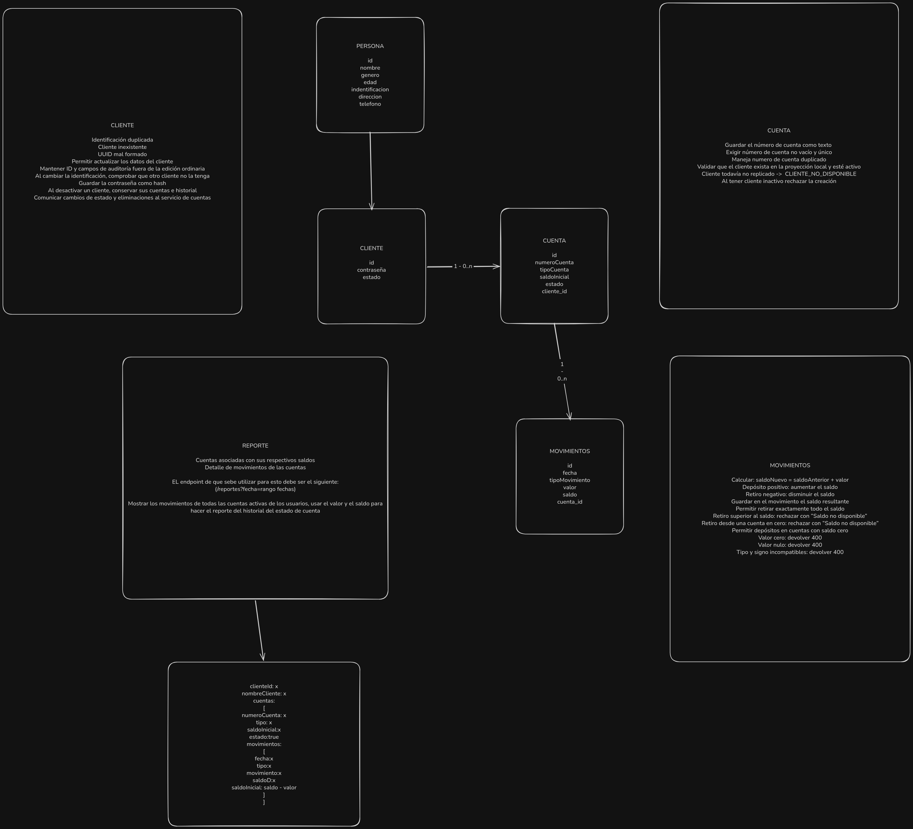

# Prueba Técnica TCS

Dos microservicios Spring Boot (Java 21) que se comunican por RabbitMQ:

- **clientes** (`:8081`): CRUD de clientes. Publica un evento cada vez que un cliente se crea, actualiza o desactiva.
- **cuentas** (`:8082`): cuentas, movimientos y reporte de estado de cuenta. Escucha esos eventos y guarda una copia local del cliente (`cliente_ref`), así que nunca llama a clientes por HTTP.

Cada servicio tiene su propia base de datos (`clientes` y `cuentas`) en el mismo PostgreSQL.

## Modelo de datos



## Levantar el proyecto

Solo se necesita Docker con Docker Compose.

```bash
docker compose up --build -d
```

La primera vez tarda unos minutos porque descarga Gradle y las dependencias.

| Servicio | URL |
|---|---|
| clientes | http://localhost:8081/api/clientes (Swagger: http://localhost:8081/swagger-ui.html) |
| cuentas | http://localhost:8082/api/cuentas, `/api/movimientos`, `/api/reportes` (Swagger: http://localhost:8082/swagger-ui.html) |
| RabbitMQ | http://localhost:15672 (usuario `tcs`, contraseña `tcs`) |
| PostgreSQL | `localhost:5432` (usuario `postgres`, contraseña `postgres`) |

Las credenciales se pueden cambiar con un archivo `.env` en la raíz (`DB_USER`, `DB_PASSWORD`, `RABBITMQ_USER`, `RABBITMQ_PASSWORD`). Sin `.env` se usan los valores de la tabla.

```bash
docker compose ps                         # estado de los contenedores
docker compose logs -f clientes cuentas   # logs de los servicios
docker compose down                       # detener
docker compose down -v                    # detener y borrar los datos
```

Antes de usar Postman, esperar a que los dos servicios muestren `Started ...Application` en los logs.

## Probar con Postman

Importa `postman/Prueba Tecnica TCS.postman_collection.json` y ejecútala completa con el **Collection Runner**, en el orden en que viene.

### El orden importa

Las peticiones dependen unas de otras y comparten variables de la colección (ids, identificaciones y números de cuenta):

1. **Clientes**: se crean Jose Lema, Marianela Montalvo y Juan Osorio. Cada creación publica un evento en RabbitMQ.
2. **Cuentas**: el servicio de cuentas recibe el evento y guarda al cliente en `cliente_ref`. Solo entonces se le puede abrir una cuenta, por eso primero hay que crear el cliente. La primera petición de esta carpeta espera 1,5 s para dar tiempo a que llegue el evento.
3. **Movimientos**: Se uso los casos de uso del documento, sobre las cuentas recién creadas.
4. **Reportes**: el estado de cuenta de Marianela Montalvo. (Caso de uso del documento)

Una petición ejecutada sola, fuera de este orden, puede fallar porque sus variables todavía están vacías.

### Identificaciones y números de cuenta

Para poder ejecutar la colección varias veces sin errores de duplicado:

- Las **identificaciones** de los clientes se generan al azar en cada ejecución (`17` + 8 dígitos).
- Los **números de cuenta** usan el número del documento como prefijo y 4 dígitos al azar, por ejemplo `225487` → `2254870391`.

El resto de los datos (nombres, tipos de cuenta, saldos iniciales y valores de los movimientos) son los del documento, así que los saldos resultantes coinciden con los esperados.

Los datos de ejecuciones anteriores se quedan en la base. Para empezar de cero: `docker compose down -v` y volver a levantar.

### Fechas del reporte

El reporte se consulta con un rango fijo: `fecha=2026-10-01,2026-10-10`. Los movimientos se guardan con la fecha y hora en que se registran, así que si la colección se ejecuta fuera de ese rango, el reporte devuelve las cuentas sin movimientos y sus tests fallan. En ese caso, cambia el parámetro `fecha` de la petición "Estado de cuenta de Marianela Montalvo" por un rango que incluya el día de hoy.

El parámetro acepta una fecha (`fecha=2026-10-02`, ese día completo) o dos separadas por coma (`fecha=2026-10-01,2026-10-10`).

## Tests

Necesitan Java 21 y Docker corriendo: los tests de integración levantan PostgreSQL y RabbitMQ con Testcontainers.

```bash
cd clientes && ./gradlew test
cd cuentas && ./gradlew test
```
